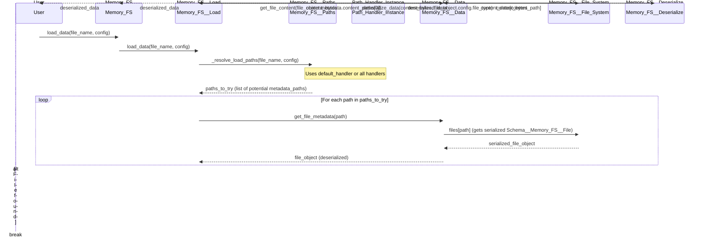
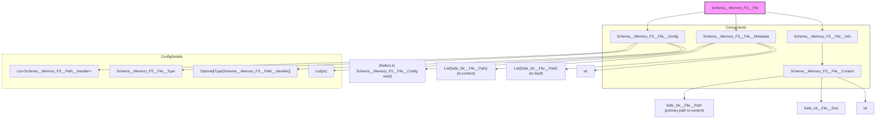

# Memory-FS: Technical Architecture Debrief

## 1. Introduction

Memory-FS is a Python library designed for type-safe, in-memory file system operations. It provides a robust and flexible way to manage "files" entirely within the application's memory space. This project was extracted and significantly refactored from the conceptual framework of `OSBot_Cloud_FS`.

The primary goal of Memory-FS is to establish a memory-first, action-based file system abstraction. It emphasizes pluggable components, such as path handlers and file types, allowing for high adaptability. This library serves as a foundational reference implementation, paving the way for future persistent storage solutions (like S3, SQLite, or local file system adapters) that will adhere to the same architectural principles.

This document provides a comprehensive overview of Memory-FS's architecture. The information presented here is synthesized from the project's codebase and existing technical debriefs located in `docs/tech_debriefs/`.

## 2. Core Concepts

Memory-FS is built upon several fundamental principles:

*   **In-Memory Storage:** All file data and associated metadata are stored directly in memory, primarily within the `Memory_FS__File_System` component. This approach guarantees extremely fast read/write operations. However, it also means that data is volatile and will be lost when the application session ends unless explicitly persisted by other means.

*   **Type Safety:** The library heavily utilizes `osbot_utils.type_safe.Type_Safe` and custom `Safe_` Pydantic models (e.g., `Safe_Str__File__Path`, `Safe_Bytes__File__Content`). This ensures data integrity at runtime by validating data types and formats, significantly reducing potential errors and improving code reliability.

*   **Action-Based Architecture:** Functionalities are decomposed into discrete action classes (e.g., `Memory_FS__Save`, `Memory_FS__Load`, `Memory_FS__Delete`). The main `Memory_FS` class acts as a facade, providing access to these actions. Benefits of this approach include:
    *   **Single Responsibility Principle (SRP):** Each action class focuses on a specific task.
    *   **Testability:** Individual actions can be tested in isolation.
    *   **Composability:** Actions can be combined to build more complex operations.
    *   **Lazy Loading:** Action instances are typically loaded on demand using the `@cache_on_self` decorator on the `Memory_FS` facade, optimizing resource usage.

*   **Two-File Storage Pattern:** Conceptually, each "file" managed by Memory-FS consists of two parts:
    *   **Metadata:** A JSON representation, typically an instance of `Schema__Memory_FS__File`, which contains configuration details, file information (like name, type), and paths to both the metadata itself and the content.
    *   **Content:** The actual file data, stored as raw bytes (`bytes`).
    This separation allows for efficient metadata operations without needing to load the entire file content. Depending on the path handlers used, multiple copies or versions of metadata and content can exist.

*   **Pluggable Path Handlers:** Derivatives of `Schema__Memory_FS__Path__Handler` (e.g., `Path__Handler__Latest`, `Path__Handler__Temporal`, `Path__Handler__Versioned`) define strategies for generating file paths for both metadata and content. A `Schema__Memory_FS__File__Config` can specify one or more path handlers, allowing for flexible file organization and retrieval strategies (e.g., always get the latest version, or a version from a specific timestamp).

*   **Extensible File Types:** Derivatives of `Schema__Memory_FS__File__Type` (e.g., `Memory_FS__File__Type__Json`, `Memory_FS__File__Type__Markdown`, `Memory_FS__File__Type__Bytes`) define the characteristics of different file formats. This includes properties like file extension, MIME content type, character encoding, and crucial serialization/deserialization logic. New file types can be easily added to support various data formats.

## 3. Architecture Deep Dive

### 3.1. Main Components Diagram

```mermaid
graph TD
    subgraph Facade
        Memory_FS["Memory_FS (Facade)"]
    end

    subgraph Actions
        Action_Save["Memory_FS__Save"]
        Action_Load["Memory_FS__Load"]
        Action_Data["Memory_FS__Data"]
        Action_Edit["Memory_FS__Edit"]
        Action_Serialize["Memory_FS__Serialize"]
        Action_Deserialize["Memory_FS__Deserialize"]
        Action_Paths["Memory_FS__Paths"]
        Action_Utils["Memory_FS__Utils"]
        Action_List["Memory_FS__List"]
        Action_Delete["Memory_FS__Delete"]
    end

    subgraph Core_Storage
        FS["Memory_FS__File_System"]
        FS_Files["files: Dict[str, Schema__Memory_FS__File]"]
        FS_Content["content_data: Dict[str, bytes]"]
        FS --> FS_Files
        FS --> FS_Content
    end

    subgraph Schemas
        Schema_File["Schema__Memory_FS__File"]
        Schema_Config["Schema__Memory_FS__File__Config"]
        Schema_Info["Schema__Memory_FS__File__Info"]
        Schema_Metadata["Schema__Memory_FS__File__Metadata"]
        Schema_Content["Schema__Memory_FS__File__Content"]
    end

    subgraph Handlers_Types
        Path_Handlers["Path Handler Classes (Path__Handler__Latest, etc.)"]
        File_Types["File Type Classes (Memory_FS__File__Type__Json, etc.)"]
    end

    Memory_FS --> Action_Save
    Memory_FS --> Action_Load
    Memory_FS --> Action_Data
    Memory_FS --> Action_Edit
    Memory_FS --> Action_Serialize
    Memory_FS --> Action_Deserialize
    Memory_FS --> Action_Paths
    Memory_FS --> Action_Utils
    Memory_FS --> Action_List
    Memory_FS --> Action_Delete


    Action_Save --> FS
    Action_Load --> FS
    Action_Data --> FS
    Action_Edit --> FS

    Action_Save --> Action_Serialize
    Action_Load --> Action_Deserialize
    Action_Save --> Action_Paths
    Action_Load --> Action_Paths
    Action_Save --> Action_Edit
    Action_Load --> Action_Data


    Action_Paths --> Path_Handlers
    Action_Serialize --> File_Types
    Action_Deserialize --> File_Types

    Schema_File --> Schema_Config
    Schema_File --> Schema_Info
    Schema_File --> Schema_Metadata
    Schema_Info --> Schema_Content

    Action_Save --> Schema_File
    Action_Load --> Schema_File
```



### 3.2. Component Descriptions

*   **`Memory_FS`**:
    *   The main entry point and public API for interacting with the file system.
    *   Acts as a facade, providing cached instances of various action classes (e.g., `save()`, `load()`, `delete()`). This simplifies usage and promotes loose coupling.

*   **`Memory_FS__File_System`**:
    *   The core in-memory storage engine. It is a simple class holding two dictionaries:
        *   `files: Dict[Safe_Str__File__Path, Schema__Memory_FS__File]`: Stores serialized `Schema__Memory_FS__File` objects (metadata) keyed by their generated metadata path.
        *   `content_data: Dict[Safe_Str__File__Path, bytes]`: Stores the actual file content as raw bytes, keyed by their generated content path.

*   **Action Classes**: These classes encapsulate specific operations. Key actions include:
    *   `Memory_FS__Save`: Orchestrates the process of saving data. This involves:
        1.  Serializing the input data using the appropriate `Memory_FS__File__Type`.
        2.  Generating metadata and content paths using the configured `Path__Handler`(s) via `Memory_FS__Paths`.
        3.  Creating a `Schema__Memory_FS__File` object.
        4.  Storing the serialized metadata and content bytes into `Memory_FS__File_System` via `Memory_FS__Edit`.
    *   `Memory_FS__Load`: Manages loading data. This involves:
        1.  Resolving potential metadata paths using `Memory_FS__Paths` and the file configuration.
        2.  Retrieving the `Schema__Memory_FS__File` (metadata) from `Memory_FS__File_System` via `Memory_FS__Data`.
        3.  Retrieving the content bytes using the content path from the metadata.
        4.  Deserializing the content bytes into a Python object using the appropriate `Memory_FS__File__Type`.
    *   `Memory_FS__Data`: Provides low-level methods for retrieving file metadata (`Schema__Memory_FS__File`) and content bytes from `Memory_FS__File_System`.
    *   `Memory_FS__Edit`: Provides low-level methods for writing and deleting metadata and content in `Memory_FS__File_System`.
    *   `Memory_FS__Serialize` / `Memory_FS__Deserialize`: Handle the conversion between Python objects and byte streams. They use the `serialization` object (e.g., `Memory_FS__Serialization__Json`) defined within the `Schema__Memory_FS__File__Type`.
    *   `Memory_FS__Paths`: Responsible for generating and resolving file paths based on the `Path__Handler`s specified in `Schema__Memory_FS__File__Config`. It currently uses a `_simulate_handler_path` method to construct paths like `latest/filename.ext` or `temporal/timestamp/filename.ext`.
    *   `Memory_FS__List`: Provides functionality to list files and directories within the in-memory file system, based on path prefixes and configurations.
    *   `Memory_FS__Delete`: Handles the removal of file metadata and content from `Memory_FS__File_System`.
    *   `Memory_FS__Utils`: Provides utility functions, such as creating default file configurations.

*   **Schema Classes**: These Pydantic models define the structure of data used throughout Memory-FS:
    *   `Schema__Memory_FS__File`: The top-level schema representing a single "file" instance in the system. It aggregates config, info, and metadata.
    *   `Schema__Memory_FS__File__Config`: Defines how a file should be handled. It includes:
        *   `path_handlers: List[Schema__Memory_FS__Path__Handler]`: A list of path handlers to apply.
        *   `default_handler: Optional[Type[Schema__Memory_FS__Path__Handler]]`: The primary handler used for loading if multiple paths exist.
        *   `file_type: Schema__Memory_FS__File__Type`: The type of the file (e.g., JSON, Markdown).
        *   `tags: List[str]`: Arbitrary tags for categorization.
    *   `Schema__Memory_FS__File__Info`: Contains basic information about the file:
        *   `file_name: str`: The base name of the file.
        *   `file_extension: str`: The file's extension.
        *   `content_type: str`: The MIME type.
        *   `file_content: Schema__Memory_FS__File__Content`: Link to content details.
    *   `Schema__Memory_FS__File__Content`: Details about the raw content:
        *   `content_path: Safe_Str__File__Path`: The direct path to the content bytes in `Memory_FS__File_System.content_data`.
        *   `content_size: Safe_Int__File__Size`: Size of the content in bytes.
        *   `content_encoding: str`: Encoding of the content (e.g., 'utf-8').
    *   `Schema__Memory_FS__File__Metadata`: Contains metadata about the stored file:
        *   `metadata_paths: List[Safe_Str__File__Path]`: Paths where this metadata object is stored.
        *   `content_paths: List[Safe_Str__File__Path]`: Paths where the associated content is stored.
        *   `content_hash: str`: A hash of the file content.
        *   `config: Schema__Memory_FS__File__Config`: A copy of the configuration used for this file instance.

*   **Path Handler Classes** (`Schema__Memory_FS__Path__Handler` derivatives):
    *   Define strategies for generating paths. For example:
        *   `Path__Handler__Latest`: Generates paths like `/latest/my_file.json`.
        *   `Path__Handler__Temporal`: Would generate time-bucketed paths like `/temporal/2023/10/26/120000/my_file.json`.
        *   `Path__Handler__Versioned`: Would generate paths like `/versioned/my_file/v1.json`, `/versioned/my_file/v2.json`.
    *   They are specified in `Schema__Memory_FS__File__Config.path_handlers`. The `Memory_FS__Paths` action uses these to determine where to store and retrieve metadata and content.

*   **File Type Classes** (`Schema__Memory_FS__File__Type` derivatives):
    *   Define the specific characteristics and behavior of different file formats (e.g., `Memory_FS__File__Type__Json`, `Memory_FS__File__Type__Markdown`).
    *   Key attributes include `name`, `content_type` (MIME), `file_extension`, `encoding`, and a `serialization` object (e.g., `Memory_FS__Serialization__Json`) that provides `serialize` and `deserialize` methods.

### 3.3. Key Workflow: Saving a File

This workflow describes the sequence of operations when `Memory_FS.save()` is called.

**Steps:**

1.  The `User` calls `Memory_FS.save(data, config, file_name)`.
2.  `Memory_FS` delegates to its cached `Memory_FS__Save` action instance.
3.  `Memory_FS__Save` uses `Memory_FS__Serialize` to convert the input `data` into `content_bytes` based on `config.file_type.serialization`.
4.  `Memory_FS__Save` iterates through each `Path__Handler` defined in `config.path_handlers`. For each handler, it calls `Memory_FS__Paths._simulate_handler_path()` (or a similar method) to generate:
    *   `metadata_path`: Path for storing the `Schema__Memory_FS__File` object.
    *   `content_path`: Path for storing the `content_bytes`.
    These paths are collected.
5.  `Memory_FS__Save` constructs the `Schema__Memory_FS__File` object (`file_object`). This object includes:
    *   The provided `config`.
    *   `Schema__Memory_FS__File__Info` (derived from `file_name`, `config.file_type`, and `content_bytes`).
    *   `Schema__Memory_FS__File__Metadata` (containing generated `metadata_paths`, `content_paths`, and a hash of `content_bytes`).
6.  For each generated `metadata_path`, `Memory_FS__Save` calls `Memory_FS__Edit.save_metadata(metadata_path, file_object)`.
7.  `Memory_FS__Edit` serializes `file_object` (usually to JSON) and stores it in `Memory_FS__File_System.files[metadata_path]`.
8.  For each unique generated `content_path`, `Memory_FS__Save` calls `Memory_FS__Edit.save_content(content_path, content_bytes)`.
9.  `Memory_FS__Edit` stores `content_bytes` in `Memory_FS__File_System.content_data[content_path]`.
10. `Memory_FS__Save` returns the primary metadata path (or all saved paths) to `Memory_FS`, which then returns it to the `User`.

**Diagram:**

```mermaid
sequenceDiagram
    participant User
    participant Memory_FS
    participant Memory_FS__Save
    participant Memory_FS__Serialize
    participant Memory_FS__Paths
    participant Path_Handler_Instance
    participant Memory_FS__Edit
    participant Memory_FS__File_System

    User->>Memory_FS: save(data, config, name)
    Memory_FS->>Memory_FS__Save: save(data, config, name)
    Memory_FS__Save->>Memory_FS__Serialize: _serialize_data(data, config.file_type)
    Memory_FS__Serialize-->>Memory_FS__Save: content_bytes
    Memory_FS__Save->>Memory_FS__Paths: generate_paths_for_save(config, name, ext)
    Note over Memory_FS__Paths,Path_Handler_Instance: For each path handler in config.path_handlers
    Memory_FS__Paths-->>Memory_FS__Save: List of (metadata_path, content_path) tuples
    Memory_FS__Save->>Memory_FS__Save: Creates Schema__Memory_FS__File object (file_object)
    loop For each metadata_path
        Memory_FS__Save->>Memory_FS__Edit: save_metadata(metadata_path, file_object)
        Memory_FS__Edit->>Memory_FS__File_System: files[metadata_path] = serialized file_object
    end
    loop For each unique content_path
        Memory_FS__Save->>Memory_FS__Edit: save_content(content_path, content_bytes)
        Memory_FS__Edit->>Memory_FS__File_System: content_data[content_path] = content_bytes
    end
    Memory_FS__Save-->>Memory_FS: primary_metadata_path or all_metadata_paths
    Memory_FS-->>User: primary_metadata_path or all_metadata_paths
end
```

### 3.4. Key Workflow: Loading a File

This workflow describes the sequence for `Memory_FS.load_data()` (or simply `load()`).

**Steps:**

1.  The `User` calls `Memory_FS.load_data(file_name, config)`.
2.  `Memory_FS` delegates to its cached `Memory_FS__Load` action instance.
3.  `Memory_FS__Load` calls `Memory_FS__Paths._resolve_load_paths(file_name, config)` to determine potential metadata paths to try. This typically uses the `config.default_handler` first, or iterates through all `config.path_handlers` if the default fails or isn't specified.
4.  For each `path_to_try` from `Memory_FS__Paths`:
    a.  `Memory_FS__Load` calls `Memory_FS__Data.get_file_metadata(path_to_try)` to retrieve the serialized `Schema__Memory_FS__File`.
    b.  `Memory_FS__Data` fetches this from `Memory_FS__File_System.files[path_to_try]`.
    c.  If found, this `file_object` (deserialized `Schema__Memory_FS__File`) is returned.
5.  Once `file_object` is successfully retrieved, `Memory_FS__Load` extracts the primary `content_path` from `file_object.metadata.content_paths` (or `file_object.info.file_content.content_path`).
6.  `Memory_FS__Load` calls `Memory_FS__Data.get_file_content(content_path)` to get the `content_bytes`.
7.  `Memory_FS__Data` fetches this from `Memory_FS__File_System.content_data[content_path]`.
8.  `Memory_FS__Load` uses `Memory_FS__Deserialize._deserialize_data(content_bytes, file_object.config.file_type)` to convert `content_bytes` back into a Python object.
9.  The deserialized data is returned by `Memory_FS__Load` to `Memory_FS`, and then to the `User`.

**Diagram:**



### 3.5. Schema Relationships Diagram

This diagram illustrates how the main `Schema__Memory_FS__File` aggregates other schema components.



## 4. Configuration

Configuration is primarily managed through the `Schema__Memory_FS__File__Config` Pydantic model. This schema is central to defining how individual files (or types of files) are handled by Memory-FS. When saving a file, a `config` object is typically required. If not provided, the system may use a default configuration.

Key attributes of `Schema__Memory_FS__File__Config`:

*   **`path_handlers: List[Schema__Memory_FS__Path__Handler]`**: A list of path handler instances (e.g., `[Path__Handler__Latest()]`). When a file is saved, paths are generated using each handler in this list. This allows metadata and content to be stored under multiple path schemes simultaneously.
*   **`default_handler: Optional[Type[Schema__Memory_FS__Path__Handler]]`**: Specifies the type of the path handler to be used by default when loading a file if multiple path versions exist. For example, if a file was saved with `Path__Handler__Latest` and `Path__Handler__Temporal`, setting `default_handler=Path__Handler__Latest` would make load operations prioritize the "latest" version.
*   **`file_type: Schema__Memory_FS__File__Type`**: An instance of a file type schema (e.g., `Memory_FS__File__Type__Json()`). This determines the file's extension, content type, and, crucially, the serialization and deserialization logic to be used.
*   **`tags: List[str]`**: A list of arbitrary string tags that can be used for categorizing or querying files.

**Example Python dictionary for `Schema__Memory_FS__File__Config`:**

```python
from memory_fs.path_handlers.Path__Handler__Latest import Path__Handler__Latest
from memory_fs.file_types.Memory_FS__File__Type__Json import Memory_FS__File__Type__Json

# This is how you would create an instance:
# from memory_fs.schemas.Schema__Memory_FS__File__Config import Schema__Memory_FS__File__Config
# file_config = Schema__Memory_FS__File__Config(
#     path_handlers=[Path__Handler__Latest()],
#     default_handler=Path__Handler__Latest,
#     file_type=Memory_FS__File__Type__Json(),
#     tags=['important', 'data']
# )

# A dictionary representation might look like this if serialized (though it contains types):
{
    "path_handlers": [{"name": "latest", "_target_class": "Path__Handler__Latest"}], # Simplified representation
    "default_handler": "Path__Handler__Latest",  # Name or reference to the type
    "file_type": {
        "name": "json",
        "content_type": "application/json",
        "file_extension": "json",
        "encoding": "utf-8",
        # serialization object would be here
    },
    "tags": ["important", "data"]
}
```
The actual instantiation in Python involves passing class types and instances directly.

## 5. Extensibility

Memory-FS is designed to be extensible, primarily through the addition of new path handlers and file types.

### Adding New Path Handlers

1.  **Create a New Class:**
    *   Define a new class that inherits from `memory_fs.schemas.Schema__Memory_FS__Path__Handler`.
2.  **Implement Attributes/Methods:**
    *   Set the `name: str` class attribute (e.g., `name = "my_custom_handler"`). This name is used internally.
    *   Implement the `generate_path(self, file_name: str, file_extension: str, is_metadata: bool) -> Safe_Str__File__Path` method.
        *   This method should return a `Safe_Str__File__Path` string representing the generated path.
        *   The `is_metadata` flag helps differentiate between paths for metadata files (e.g., `Schema__Memory_FS__File` JSONs) and content files (actual data).
        *   *Current Implementation Note:* The `Memory_FS__Paths` action currently uses a `_simulate_handler_path` method that often relies on the handler's `name` to construct a path prefix (e.g., `f"{handler.name}/{file_name}.{file_extension}"`). While direct `generate_path` on handlers is the long-term design, ensure compatibility or update `Memory_FS__Paths` if creating complex custom logic.
3.  **Use in Configuration:**
    *   Instantiate your new path handler.
    *   Include it in the `path_handlers` list of a `Schema__Memory_FS__File__Config` object.
    *   Optionally, set it as the `default_handler`.

**Example:**
```python
# my_custom_handler.py
from memory_fs.schemas.Schema__Memory_FS__Path__Handler import Schema__Memory_FS__Path__Handler
from memory_fs.schemas.types.Safe_Str__File__Path import Safe_Str__File__Path

class Path__Handler__User_Specific(Schema__Memory_FS__Path__Handler):
    name: str = "user_specific"
    user_id: str

    def generate_path(self, file_name: str, file_extension: str, is_metadata: bool) -> Safe_Str__File__Path:
        base_path = f"{self.name}/{self.user_id}/{file_name}.{file_extension}"
        if is_metadata:
            return Safe_Str__File__Path(f"{base_path}.metadata.json")
        return Safe_Str__File__Path(base_path)

# usage_example.py
# from memory_fs.schemas.Schema__Memory_FS__File__Config import Schema__Memory_FS__File__Config
# from memory_fs.file_types.Memory_FS__File__Type__Text import Memory_FS__File__Type__Text # Assuming this exists
# from my_custom_handler import Path__Handler__User_Specific

# user_handler = Path__Handler__User_Specific(user_id="user123")
# custom_config = Schema__Memory_FS__File__Config(
#     path_handlers=[user_handler],
#     file_type=Memory_FS__File__Type__Text(),
#     default_handler=Path__Handler__User_Specific
# )
```

### Adding New File Types

1.  **Create a New Class:**
    *   Define a new class that inherits from `memory_fs.schemas.Schema__Memory_FS__File__Type`.
2.  **Define Attributes:**
    *   `name: str`: A unique name for the file type (e.g., "yaml", "pickle").
    *   `content_type: str`: The MIME type (e.g., "application/x-yaml", "application/octet-stream").
    *   `file_extension: str`: The typical file extension (e.g., "yaml", "pkl").
    *   `encoding: Optional[str]`: Character encoding if applicable (e.g., "utf-8", None for binary).
    *   `serialization: Any`: An object that provides `serialize(data: Any) -> bytes` and `deserialize(content_bytes: bytes) -> Any` methods. You might need to create a new serialization class (e.g., `Memory_FS__Serialization__Yaml`).
3.  **Implement Serialization Logic:**
    *   Ensure the `serialization` object correctly converts data to bytes and vice-versa for your new file type.
4.  **Use in Configuration:**
    *   Instantiate your new file type.
    *   Set it as the `file_type` in a `Schema__Memory_FS__File__Config` object.

**Example:**
```python
# my_custom_file_types.py
from typing import Any, Optional
from memory_fs.schemas.Schema__Memory_FS__File__Type import Schema__Memory_FS__File__Type
# Assume a custom serialization class:
# class MySerializationProtocol:
#     def serialize(self, data: Any) -> bytes: ...
#     def deserialize(self, content_bytes: bytes) -> Any: ...

# class YamlSerialization(MySerializationProtocol):
#     import yaml # Requires PyYAML
#     def serialize(self, data: Any) -> bytes:
#         return yaml.dump(data).encode('utf-8')
#     def deserialize(self, content_bytes: bytes) -> Any:
#         return yaml.safe_load(content_bytes.decode('utf-8'))

class Memory_FS__File__Type__Yaml(Schema__Memory_FS__File__Type):
    name            : str = "yaml"
    content_type    : str = "application/x-yaml"
    file_extension  : str = "yaml"
    encoding        : Optional[str] = "utf-8"
    # serialization   : MySerializationProtocol = YamlSerialization() # Instance here

# usage_example.py
# from memory_fs.schemas.Schema__Memory_FS__File__Config import Schema__Memory_FS__File__Config
# from memory_fs.path_handlers.Path__Handler__Latest import Path__Handler__Latest
# from my_custom_file_types import Memory_FS__File__Type__Yaml

# yaml_config = Schema__Memory_FS__File__Config(
#     path_handlers=[Path__Handler__Latest()],
#     file_type=Memory_FS__File__Type__Yaml()
# )
# memory_fs.save("my_data.yaml", {"key": "value"}, config=yaml_config)
```

## 6. Relationship to OSBot_Cloud_FS and Future Implementations

Memory-FS is the first concrete, functional implementation of the architectural concepts initially developed and prototyped within the `OSBot_Cloud_FS` project. It serves as a live reference implementation and a robust testbed for the action-based architecture, type safety, and pluggable component model.

The core design of Memory-FS, particularly its separation of concerns (actions, storage, schemas, handlers), is intended to be replicated across various storage backends. The planned future storage adapters include:

*   **S3-FS:** An adapter for Amazon S3.
*   **SQLite-FS:** An adapter using SQLite for metadata and potentially content storage.
*   **FileSystem-FS:** An adapter for the local operating system's file system.

These future implementations will aim to expose the same (or a very similar) action-based API as Memory-FS. This consistency will allow developers to switch between different storage backends with minimal changes to their application code, achieving a unified cloud and local storage abstraction.

## 7. Conclusion

The Memory-FS architecture offers a powerful and developer-friendly approach to in-memory file management. Its key strengths include:

*   **Flexibility:** Pluggable path handlers and file types allow adaptation to diverse requirements.
*   **Type Safety:** Rigorous use of Pydantic models and type hints enhances reliability and reduces runtime errors.
*   **Testability:** The action-based design promotes modularity, making components individually testable.
*   **Clear Separation of Concerns:** Distinct responsibilities for actions, storage, schemas, and configuration lead to a more maintainable and understandable codebase.

Memory-FS is not just an in-memory file system; it's a blueprint. It validates the core architectural patterns that will underpin a broader ecosystem of storage solutions, aiming to provide a consistent and unified interface for interacting with data, regardless of where it's stored.
```
