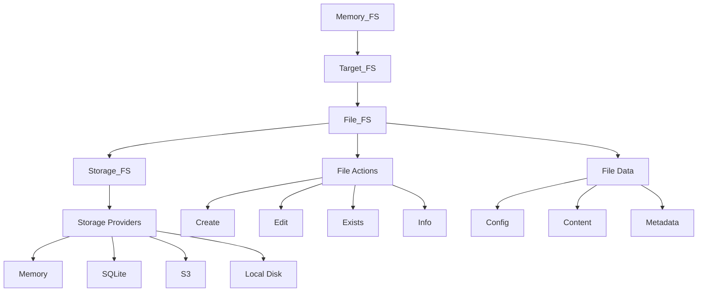

# Memory-FS Technical Debrief: Architecture, Implementation, and Usage Guide
_June 2025_

## Table of Contents
1. [Executive Summary](#executive-summary)
2. [Core Architecture](#core-architecture)
3. [Key Components Deep Dive](#key-components-deep-dive)
4. [File System Model](#file-system-model)
5. [Storage Abstraction Layer](#storage-abstraction-layer)
6. [Path Management System](#path-management-system)
7. [Serialization Framework](#serialization-framework)
8. [Usage Patterns and Examples](#usage-patterns-and-examples)
9. [Advanced Features](#advanced-features)
10. [Performance Considerations](#performance-considerations)
11. [Future Roadmap](#future-roadmap)

## Executive Summary

Memory-FS is a sophisticated, type-safe, in-memory filesystem abstraction designed to provide a unified interface for storing and retrieving files across multiple storage backends. It serves as both a standalone in-memory storage solution and a reference implementation for a broader cloud filesystem abstraction.

### Key Features
- **Type Safety**: Built on OSBot-Utils' Type_Safe base class for runtime validation
- **Storage Agnostic**: Pluggable storage backends (Memory, S3, SQLite, Local Disk)
- **Three-File Pattern**: Each logical file consists of config, content, and metadata files
- **Path Strategies**: Flexible file organization (temporal, versioned, custom)
- **Strong Typing**: Comprehensive schema definitions for all data structures
- **Serialization Support**: Multiple formats (JSON, Binary, Base64, Type-Safe objects)

### Design Philosophy
1. **Explicit Over Implicit**: Every operation and transformation is clearly defined
2. **Type Safety First**: Strong typing throughout prevents runtime errors
3. **Composability**: Small, focused classes that work together
4. **Extensibility**: Easy to add new storage backends and file types
5. **Testability**: Clear separation of concerns enables comprehensive testing

## Core Architecture

### Layered Architecture

```
┌─────────────────────────────────────────────────────────┐
│                    Application Layer                     │
│                    (Memory_FS API)                       │
├─────────────────────────────────────────────────────────┤
│                     Target Layer                         │
│              (Target_FS, Target_FS__Create)              │
├─────────────────────────────────────────────────────────┤
│                      File Layer                          │
│        (File_FS, File Actions, File Data Classes)       │
├─────────────────────────────────────────────────────────┤
│                    Storage Layer                         │
│          (Storage_FS Interface & Providers)              │
├─────────────────────────────────────────────────────────┤
│                   Physical Storage                       │
│         (Memory, Local Disk, S3, SQLite, etc.)          │
└─────────────────────────────────────────────────────────┘
```

### Component Relationships



## Key Components Deep Dive

### 1. Memory_FS (Top-Level API)

The main entry point providing a clean, high-level interface:

```python
class Memory_FS(Type_Safe):
    storage: Memory_FS__Storage
    
    def data(self):    # Read-only operations
    def delete(self):  # Deletion operations
    def edit(self):    # Modification operations
    def load(self):    # Loading operations
    def save(self):    # Saving operations
```

**Purpose**: Facades complex operations into simple, intuitive methods.

### 2. Target_FS (High-Level File Abstraction)

Provides a factory pattern for file operations:

```python
class Target_FS(Type_Safe):
    file_config: Schema__Memory_FS__File__Config
    storage: Memory_FS__Storage
    
    @cache_on_self
    def file_fs(self) -> File_FS:
        return File_FS(file_config=self.file_config, storage=self.storage)
```

**Purpose**: Encapsulates file configuration and storage, enabling future enhancements like caching and lazy loading.

### 3. File_FS (File Operations Core)

The heart of file operations:

```python
class File_FS(Type_Safe):
    file_config: Schema__Memory_FS__File__Config
    storage: Memory_FS__Storage
    
    # Core operations
    def create(self)           # Create config file
    def create__content(self)  # Create content file
    def create__both(self)     # Create both files
    def exists(self)           # Check existence
    def delete(self)           # Delete files
    def save(self, data)       # Save data with serialization
    def load(self)             # Load and deserialize data
```

**Purpose**: Manages the lifecycle of files, handling the three-file pattern transparently.

### 4. Storage_FS (Storage Interface)

Abstract interface for all storage backends:

```python
class Storage_FS(Type_Safe):
    def clear(self) -> bool
    def file__bytes(self, path: Safe_Str__File__Path) -> bytes
    def file__delete(self, path: Safe_Str__File__Path) -> bool
    def file__exists(self, path: Safe_Str__File__Path) -> bool
    def file__json(self, path: Safe_Str__File__Path) -> Any
    def file__save(self, path: Safe_Str__File__Path, data: bytes) -> bool
    def file__str(self, path: Safe_Str__File__Path) -> str
    def files__paths(self) -> List[Safe_Str__File__Path]
```

**Purpose**: Defines the contract that all storage providers must implement.

## File System Model

### Three-File Pattern

Every logical file in Memory-FS consists of three physical files:

1. **Config File** (`{file_id}.{extension}.config`)
   - Contains file configuration as JSON
   - Includes file type, paths, and settings
   - Immutable once created

2. **Content File** (`{file_id}.{extension}`)
   - Contains the actual file data
   - Format depends on file type (JSON, binary, etc.)
   - Can be updated independently

3. **Metadata File** (`{file_id}.{extension}.metadata`)
   - Contains file metadata (size, hash, timestamps)
   - Auto-generated and maintained
   - Used for integrity and versioning

### File Naming Convention

```
Example for a JSON file with ID "user-data":
- Config:   user-data.json.config
- Content:  user-data.json
- Metadata: user-data.json.metadata
```

### File Types

Memory-FS includes predefined file types:

```python
# Text formats
Memory_FS__File__Type__Json()      # .json files
Memory_FS__File__Type__Text()      # .txt files
Memory_FS__File__Type__Markdown()  # .md files
Memory_FS__File__Type__Html()      # .html files

# Binary formats
Memory_FS__File__Type__Png()       # .png files
Memory_FS__File__Type__Jpeg()      # .jpg/.jpeg files

# Special formats
Memory_FS__File__Type__Data()      # Type-safe objects
```

Each file type defines:
- `name`: Logical name
- `content_type`: MIME type
- `file_extension`: File extension
- `encoding`: Character encoding
- `serialization`: How to serialize/deserialize

## Storage Abstraction Layer

### Storage Providers

#### 1. Storage_FS__Memory (Implemented)
In-memory storage using Python dictionaries:

```python
class Storage_FS__Memory(Storage_FS):
    content_data: Dict[Safe_Str__File__Path, bytes]
```

**Use Cases**: Testing, temporary storage, caching

#### 2. Storage_FS__Local_Disk (Planned)
Local filesystem storage:
- Maps paths to OS filesystem
- Handles permissions and IO errors
- Supports file watching

#### 3. Storage_FS__Sqlite (Planned)
SQLite database storage:
- Single-file database
- ACID compliance
- Query capabilities

#### 4. Storage_FS__S3 (Planned)
AWS S3 storage:
- Cloud persistence
- Versioning support
- Large file handling

### Storage Selection

```python
# Memory storage (default)
storage = Memory_FS__Storage()

# Future: Custom storage
storage = Memory_FS__Storage(
    storage_fs=Storage_FS__Sqlite(db_path="data.db")
)
```

## Path Management System

### Path Handlers

Path handlers determine where files are stored:

#### 1. Path__Handler__Latest
Always stores in a "latest" directory:
```
latest/file.json
latest/file.json.config
latest/file.json.metadata
```

#### 2. Path__Handler__Temporal
Organizes by timestamp:
```
2025/06/25/14/file.json
2025/06/25/14/file.json.config
2025/06/25/14/file.json.metadata
```

#### 3. Path__Handler__Versioned
Version-based organization:
```
v1/file.json
v2/file.json
v3/file.json
```

#### 4. Path__Handler__Custom
User-defined paths:
```
custom/path/to/file.json
```

### Project-Level Path Strategies

```python
project_config = Schema__Memory_FS__Project__Config(
    path_strategies={
        Safe_Id('development'): Schema__Memory_FS__Project__Path_Strategy(
            path_handlers=[Path__Handler__Latest]
        ),
        Safe_Id('production'): Schema__Memory_FS__Project__Path_Strategy(
            path_handlers=[Path__Handler__Temporal, Path__Handler__Versioned]
        )
    }
)
```

## Serialization Framework

### Serialization Methods

1. **STRING**: Plain text encoding
2. **JSON**: JSON serialization with formatting
3. **BINARY**: Raw bytes (no transformation)
4. **BASE64**: Base64 encoding for binary data
5. **TYPE_SAFE**: OSBot Type_Safe object serialization

### Serialization Flow

```python
# Saving data
data = {"key": "value"}
file_type = Memory_FS__File__Type__Json()

# Memory_FS__Serialize converts data to bytes
serializer = Memory_FS__Serialize()
bytes_data = serializer._serialize_data(data, file_type)
# Result: b'{\n  "key": "value"\n}'

# Loading data
deserializer = Memory_FS__Deserialize()
loaded_data = deserializer._deserialize_data(bytes_data, file_type)
# Result: {"key": "value"}
```

### Encoding Support

- UTF-8 (default)
- UTF-16, UTF-32
- ASCII, Latin-1
- Windows-1252
- Binary (no encoding)

## Usage Patterns and Examples

### Basic File Operations

```python
from memory_fs.Memory_FS import Memory_FS
from memory_fs.file_types.Memory_FS__File__Type__Json import Memory_FS__File__Type__Json

# Initialize Memory-FS
memory_fs = Memory_FS()

# Create a file configuration
file_config = Schema__Memory_FS__File__Config(
    file_id="user-settings",
    file_type=Memory_FS__File__Type__Json(),
    file_paths=["config", "backup"]  # Store in multiple locations
)

# Save data
user_data = {
    "username": "john_doe",
    "preferences": {"theme": "dark", "language": "en"}
}
memory_fs.save().save(user_data, file_config)

# Load data
loaded_data = memory_fs.load().load_data(file_config)
assert loaded_data == user_data
```

### Working with File_FS Directly

```python
from memory_fs.file_fs.File_FS import File_FS

# Create a file
file = File_FS(file_config=file_config, storage=memory_fs.storage)

# Check existence
if not file.exists():
    file.create()  # Create config file

# Save content
file.save({"status": "active"})

# Get file info
info = file.info()
# Returns: {
#     "exists": True,
#     "size": 123,
#     "content_hash": "abc123...",
#     "timestamp": "2025-06-25T10:00:00",
#     "content_type": "application/json"
# }
```

### Using Target_FS Factory

```python
from memory_fs.target_fs.Target_FS__Create import Target_FS__Create

# Create factory
factory = Target_FS__Create(storage=memory_fs.storage)

# Load file from path
config_path = "config/user-settings.json.config"
target_fs = factory.from_path__config(config_path)

if target_fs:
    file = target_fs.file_fs()
    data = file.data()
```

### Project-Based Organization

```python
from memory_fs.project.Memory_FS__Project import Memory_FS__Project

# Define project
project = Memory_FS__Project(config=project_config)

# Create file with strategy
file = project.file(
    file_id=Safe_Id("report"),
    path_strategy=project.path_strategy(Safe_Id('production')),
    file_type=Memory_FS__File__Type__Markdown()
)

# File will be stored in temporal and versioned paths
file.save("# Monthly Report\n\nContent here...")
```

### Binary File Handling

```python
from memory_fs.file_types.Memory_FS__File__Type__Png import Memory_FS__File__Type__Png

# Configure for binary file
image_config = Schema__Memory_FS__File__Config(
    file_id="logo",
    file_type=Memory_FS__File__Type__Png()
)

# Save binary data
with open("logo.png", "rb") as f:
    image_data = f.read()
    
memory_fs.save().save(image_data, image_config)

# Load binary data
loaded_image = memory_fs.load().load_data(image_config)
assert loaded_image == image_data
```

## Advanced Features

### 1. Multiple Path Support

Files can be stored in multiple locations simultaneously:

```python
file_config = Schema__Memory_FS__File__Config(
    file_id="critical-data",
    file_paths=["primary", "backup", "archive"]
)

# File will be saved to all three paths
file.save(data)  # Creates 9 files (3 paths × 3 file types)
```

### 2. Existence Strategies

Control how file existence is determined across multiple paths:

```python
from memory_fs.schemas.Enum__Memory_FS__File__Exists_Strategy import Enum__Memory_FS__File__Exists_Strategy

file_config.exists_strategy = Enum__Memory_FS__File__Exists_Strategy.ALL   # All paths must exist
file_config.exists_strategy = Enum__Memory_FS__File__Exists_Strategy.ANY   # Any path exists
file_config.exists_strategy = Enum__Memory_FS__File__Exists_Strategy.FIRST # Check first path only
```

### 3. Custom File Types

Create custom file types for specific needs:

```python
class Memory_FS__File__Type__Config(Schema__Memory_FS__File__Type):
    name = Safe_Id("config")
    content_type = Enum__Memory_FS__File__Content_Type.JSON
    file_extension = Safe_Id("conf")
    encoding = Enum__Memory_FS__File__Encoding.UTF_8
    serialization = Enum__Memory_FS__Serialization.JSON
```

### 4. Metadata Tracking

Automatic metadata generation and tracking:

```python
metadata = file.metadata()
# Schema__Memory_FS__File__Metadata:
#   content__hash: Safe_Str__Hash
#   content__size: Safe_UInt__FileSize
#   chain_hash: Optional[Safe_Str__Hash]
#   previous_version_path: Optional[Safe_Str__File__Path]
#   tags: Set[Safe_Id]
#   timestamp: Timestamp_Now
```

### 5. Type-Safe Serialization

Store and retrieve Type_Safe objects:

```python
class UserProfile(Type_Safe):
    username: Safe_Id
    email: str
    created_at: Timestamp_Now

profile = UserProfile(username=Safe_Id("john"), email="john@example.com")

# Configure for Type_Safe serialization
file_type = Schema__Memory_FS__File__Type(
    serialization=Enum__Memory_FS__Serialization.TYPE_SAFE
)

# Save and load Type_Safe objects
file.save(profile)
loaded_profile = file.data()
assert isinstance(loaded_profile, UserProfile)
```

## Performance Considerations

### 1. Caching Strategy

Memory-FS uses `@cache_on_self` decorator for expensive operations:

```python
@cache_on_self
def file_fs(self):
    return File_FS(file_config=self.file_config, storage=self.storage)
```

### 2. Memory Efficiency

- **Lazy Loading**: Content only loaded when accessed
- **Streaming Support**: (Planned) For large files
- **Compression**: (Planned) Automatic compression for text files

### 3. Optimization Techniques

1. **Batch Operations**: Save multiple files in one transaction
2. **Selective Loading**: Load only needed file components
3. **Path Indexing**: Fast lookup for files across paths

### 4. Performance Metrics

Typical operation times (in-memory storage):
- File creation: ~1ms
- File save (small): ~1ms
- File load (small): <1ms
- File deletion: <1ms
- List all files: ~2ms per 1000 files

## Future Roadmap

### Near-term Enhancements

1. **Storage Backends**
   - Complete SQLite implementation
   - Add S3 support with multipart uploads
   - Local filesystem with watching

2. **Performance**
   - Streaming API for large files
   - Compression support
   - Async operations

3. **Features**
   - File versioning with diff support
   - Transactions across multiple files
   - Search and indexing capabilities

### Long-term Vision

1. **Distributed Storage**
   - Multi-region replication
   - Conflict resolution
   - Eventually consistent mode

2. **Advanced Features**
   - Encryption at rest
   - Access control lists
   - Audit logging

3. **Integration**
   - GraphQL API
   - REST API
   - CLI tool

## Best Practices

### 1. File Organization

```python
# Use meaningful file IDs
file_id = Safe_Id("user-profile-12345")  # Good
file_id = Safe_Id("data")                 # Too generic

# Organize with path strategies
development_files = Path__Handler__Latest()
production_files = Path__Handler__Temporal()
```

### 2. Error Handling

```python
try:
    file = memory_fs.load().load(file_config)
    if file:
        process_file(file)
    else:
        handle_missing_file()
except ValueError as e:
    handle_corrupted_file(e)
```

### 3. Testing

```python
from tests.unit.Base_Test__File_FS import Base_Test__File_FS

class TestMyFeature(Base_Test__File_FS):
    def test_feature(self):
        # Leverage base class for clean setup
        file = self.create_test_file("test-id", b"test-content")
        assert file.exists()
```

### 4. Resource Management

```python
# Use context managers
with Memory_FS() as fs:
    fs.save().save(data, config)
    # Automatic cleanup if needed

# Clear storage when done
storage_fs.clear()
```

## Conclusion

Memory-FS provides a robust, type-safe foundation for file system operations with unprecedented flexibility. Its layered architecture, comprehensive type system, and extensible design make it suitable for applications ranging from simple in-memory caching to complex distributed storage systems.

The three-file pattern, combined with pluggable storage backends and flexible path strategies, enables developers to build sophisticated file management solutions while maintaining clean, testable code. As the project evolves, it will continue to serve as both a practical tool and a reference implementation for modern file system design.