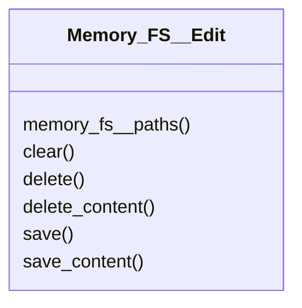

# actions/Memory_FS__Edit.py

## Description
Implements editing helpers that save or delete files from the underlying storage.
## Classes
### Memory_FS__Edit
Methods:
- `memory_fs__paths`
- `clear`
- `delete`
- `delete_content`
- `save`
- `save_content`

