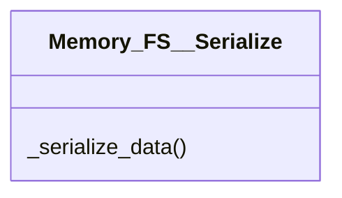

# actions/Memory_FS__Serialize.py

## Description
Serializes Python data into bytes based on the requested format such as JSON or base64.
## Classes
### Memory_FS__Serialize
Methods:
- `_serialize_data`

