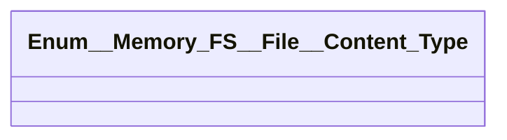

# schemas/Enum__Memory_FS__File__Content_Type.py

## Description
Enumeration of allowed content types such as JSON or PNG.
## Classes
### Enum__Memory_FS__File__Content_Type

```mermaid
classDiagram
    class Enum__Memory_FS__File__Content_Type {
    }
```
