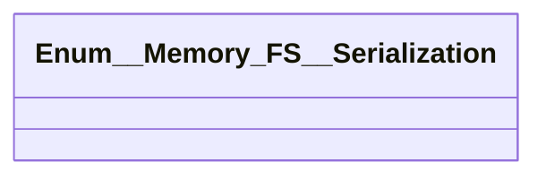

# schemas/Enum__Memory_FS__Serialization.py

## Description
Enumeration controlling how complex data is serialized to bytes.
## Classes
### Enum__Memory_FS__Serialization

```mermaid
classDiagram
    class Enum__Memory_FS__Serialization {
    }
```
