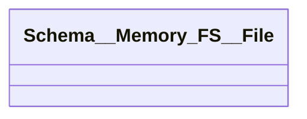

# schemas/Schema__Memory_FS__File.py

## Description
Schema bundling together a file's config and its metadata.
## Classes
### Schema__Memory_FS__File

```mermaid
classDiagram
    class Schema__Memory_FS__File {
    }
```
