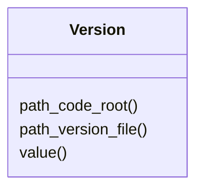

# utils/Version.py

## Description
Helper to read the current version from the package directory.
## Classes
### Version
Methods:
- `path_code_root`
- `path_version_file`
- `value`

```mermaid
classDiagram
    class Version {
        path_code_root()
        path_version_file()
        value()
    }
```
