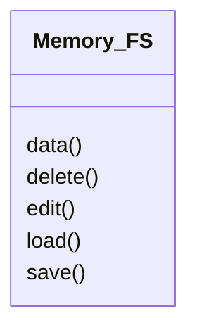

# Memory_FS.py

## Description
The main entry point to the in-memory file system. The `Memory_FS` class wires together all action classes such as load, save and delete.
## Classes
### Memory_FS
Methods:
- `data`
- `delete`
- `edit`
- `load`
- `save`

