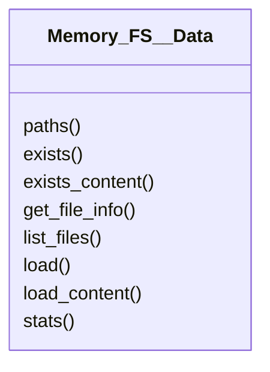

# actions/Memory_FS__Data.py

## Description
Implements `Memory_FS__Data` which provides low level operations for reading file metadata and raw content from storage.
## Classes
### Memory_FS__Data
Methods:
- `paths`
- `exists`
- `exists_content`
- `get_file_info`
- `list_files`
- `load`
- `load_content`
- `stats`

