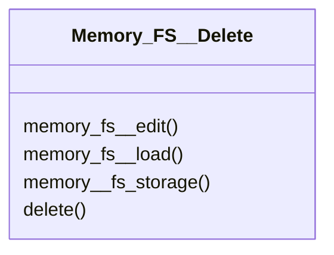

# actions/Memory_FS__Delete.py

## Description
Defines `Memory_FS__Delete` used to remove files and their stored content. It leverages the edit and load actions to perform cleanup.
## Classes
### Memory_FS__Delete
Methods:
- `memory_fs__edit`
- `memory_fs__load`
- `memory__fs_storage`
- `delete`

