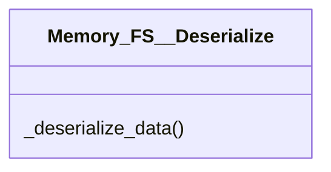

# actions/Memory_FS__Deserialize.py

## Description
Contains `Memory_FS__Deserialize`, responsible for converting stored bytes into Python data according to the file's serialization format.
## Classes
### Memory_FS__Deserialize
Methods:
- `_deserialize_data`

