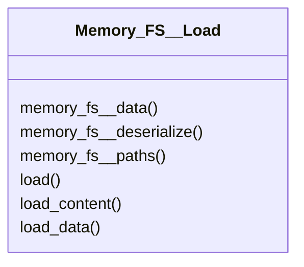

# actions/Memory_FS__Load.py

## Description
Provides methods for locating and loading files from the configured paths. Includes helpers to fetch raw content or deserialized objects.
## Classes
### Memory_FS__Load
Methods:
- `memory_fs__data`
- `memory_fs__deserialize`
- `memory_fs__paths`
- `load`
- `load_content`
- `load_data`

