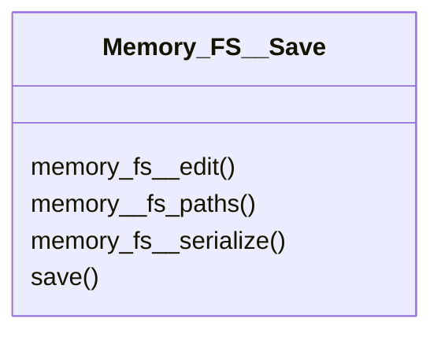

# actions/Memory_FS__Save.py

## Description
High level save routine that serializes data and writes both metadata and content to all configured locations.
## Classes
### Memory_FS__Save
Methods:
- `memory_fs__edit`
- `memory__fs_paths`
- `memory_fs__serialize`
- `save`

