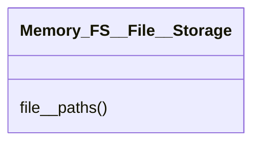

# file/Memory_FS__File__Storage.py

## Description
Defines storage configuration for a single file including how path handlers are combined.
## Classes
### Schema__Memory_FS__File__Storage__Config

### Memory_FS__File__Storage
Methods:
- `file__paths`

