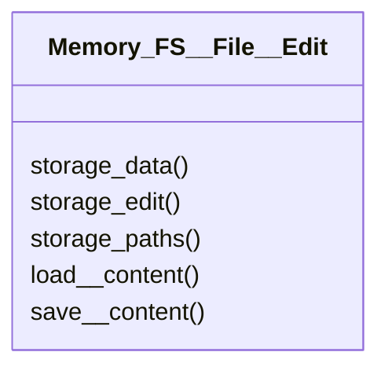

# file/actions/Memory_FS__File__Edit.py

## Description
Editing helpers to manipulate an individual file's content.
## Classes
### Memory_FS__File__Edit
Methods:
- `storage_data`
- `storage_edit`
- `storage_paths`
- `load__content`
- `save__content`

