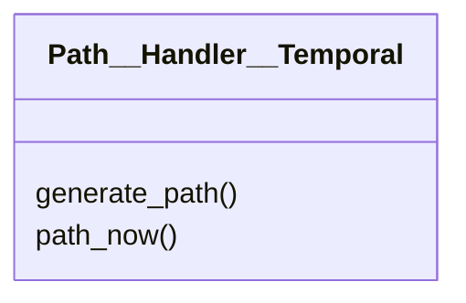

# path_handlers/Path__Handler__Temporal.py

## Description
Builds a path that embeds a timestamp creating a simple history of versions.
## Classes
### Path__Handler__Temporal
Methods:
- `generate_path`
- `path_now`

