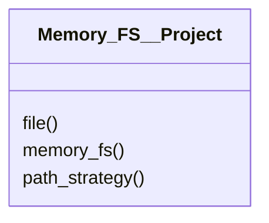

# project/Memory_FS__Project.py

## Description
High level helper for working with sets of files organised into projects.
## Classes
### Memory_FS__Project
Methods:
- `file`
- `memory_fs`
- `path_strategy`

