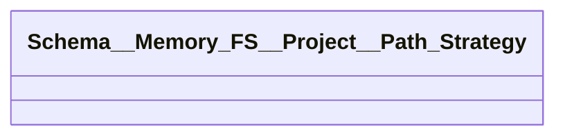
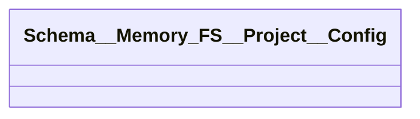

# project/Schema__Memory_FS__Project__Config.py

## Description
Schema defining how a project is configured including its available path strategies and storage provider.
## Classes
### Schema__Memory_FS__Project__Path_Strategy

### Schema__Memory_FS__Project__Config

