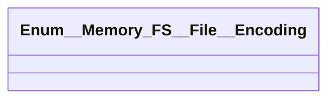

# schemas/Enum__Memory_FS__File__Encoding.py

## Description
Enumeration of encoding choices used when reading or writing text.
## Classes
### Enum__Memory_FS__File__Encoding

```mermaid
classDiagram
    class Enum__Memory_FS__File__Encoding {
    }
```
