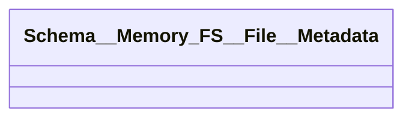

# schemas/Schema__Memory_FS__File__Metadata.py

## Description
Schema capturing size, hash and timestamp information about stored content.
## Classes
### Schema__Memory_FS__File__Metadata

```mermaid
classDiagram
    class Schema__Memory_FS__File__Metadata {
    }
```
