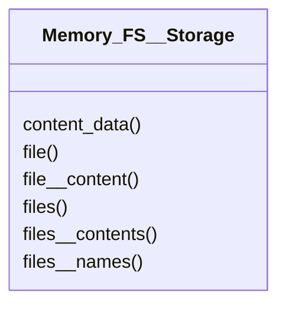

# storage/Memory_FS__Storage.py

## Description
Implements the in-memory storage backend used by the rest of the system.
## Classes
### Memory_FS__Storage
Methods:
- `content_data`
- `file`
- `file__content`
- `files`
- `files__contents`
- `files__names`

